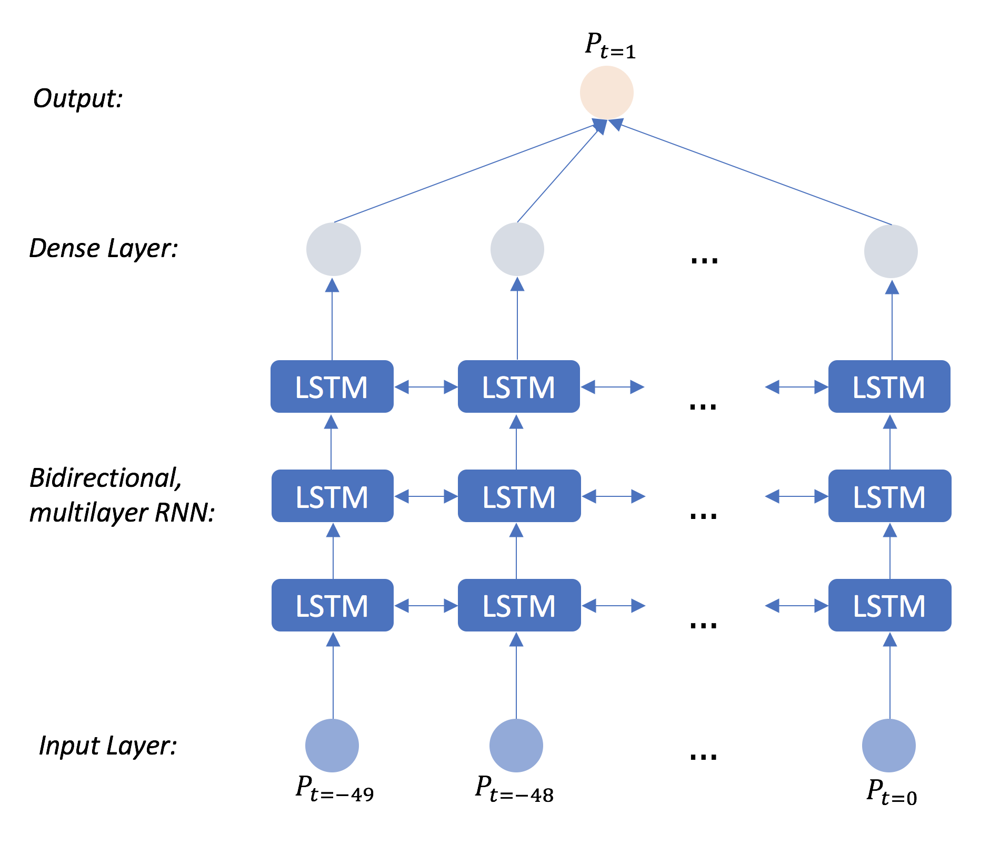

# cryptocurrency-prediction
LSTM model for predicting the price of Bitcoin. 

### Deep Learning:

3 layer bidirectional RNN to predict the closing price of Bitcoin given a variety of data from previous days. Code for scraping cryptocurrency data is included, as well as the LSTM model. The RNN architecture is shown as follows:

### Data Processing:

Scraping the data yields a 2D tensor of m samples by n features. We used a time-series transform to turn this into a set of windows data with window size w=50, yielding a 3D tensor of shape (m - w) samples by n features by w day window size. For instance, our first data point m=0 had a 2D tensor of m features for each of 0-49 days. Then, we normalized the data. Finally, we separated this into the input and output data by removing the last day and making it the output data. Refer to below for a visualization of this.

![alt text][processing]

[processing]: https://github.com/jasonwengwei/cryptocurrency-prediction/blob/master/processing.png

### Results

Our model predicts slightly better than random on testing data over a 3-month period. Predicting cryptocurrency prices is challenging, even for humans...

### Acknowledgements

I worked on this with William Wolfe-McGuire. This code provides several improvements to <a href="https://www.youtube.com/watch?v=ftMq5ps503w&t=458s">Siraj's stock prediction</a>.
